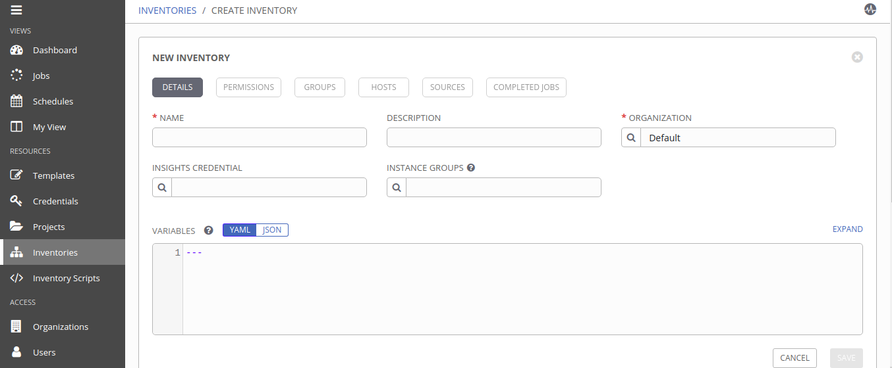
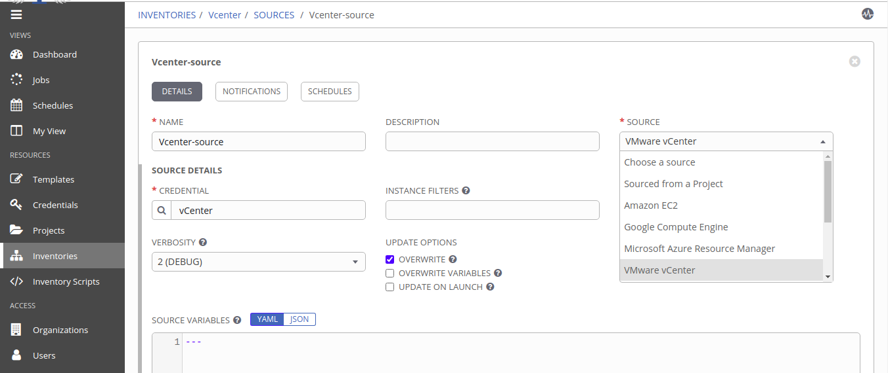

# MultiCloud VM Deployment [ AWS ]
<p >
  <a href="https://aws.amazon.com/"></a>
  </p>


This Component provides automated deployment of of virtual machine (EC2 Instance) on AWS. 

## Product Information
--------------------
Product: AWS

Vendor: Amazon

Vendor Site: https://aws.amazon.com/

Version Supported: N/A

## Requirements
------------

Tested Operating Systems

- UBUNTU 18.04 LTS

Operating System Pre-Requisites

- Linux Machine
	  
## Dependencies
------------
1. [awscli](https://aws.amazon.com/cli/) should be configured with aws creds
2. [boto3](https://boto3.amazonaws.com/v1/documentation/api/latest/guide/quickstart.html) `Python SDK for AWS`


## Installation and Configuration

Use the package manager [pip](https://pip.pypa.io/en/stable/) to install boto3.

```
pip3 install boto3
```
Configure [awscli](https://aws.amazon.com/cli/) with your server as follows.
```
sudo apt-get install awscli   
```
Then you can to configure your credentials file as follows:
```
aws configure
```
Alternatively, you can create the credential file yourself. By default, its location is at `~/.aws/credentials`
```
[default]
aws_access_key_id = YOUR_ACCESS_KEY
aws_secret_access_key = YOUR_SECRET_KEY
```
You may also want to set a default region. This can be done in the configuration file. By default, its location is at `~/.aws/config`
```
[default]
region=YOUR_DEFAULT_REGION
```


## Modules
------------------


1- `ec2`: This only one module used to perform all actions on EC2 instance


## Role Variables


| Variable Name   | Variable Description   |  Example Value of Variable | Variable Type
| :---------------| :----------------------| :--------------------------| :----------------
|  {{ image }} | AMI ID to use for the instance.(OS Flavour)  | ami-040c7ad0a93be494e | user-input
|  {{ security_group }}  | Security groups can provide an efficient way to assign access to resources on your network | Security_Group01 | user-input
|  {{ instance_type }}  | Instance type defines size of resouces to be used with instance (CPU,Disk,Memory)  | t2.micro |  user-input
| {{ count }} | specifies number of instance to be spawned | 2 | user-input
|  {{ keypair }}  |  Keypair is used to access your instance via SSH or Putty  |  keypai01 | Default
| {{ region }} | reagion/zone in which your instance is located | south-ap-1 | Default


 


## Extra variables JSON structure
```
{
  "extra_vars": {
    "provider": [
      "aws"
    ],
    "config_attributes" : {
       "aws" : {
            "security_group" : "OnceAgain2",
            "instance_type" :"t2.small",
            "image":"ami-040c7ad0a93be494e",
            "count": "2"
        }
    }
  
  }
}
```
## Dynamic Inventory Sync

- Step 1: Go to Inventory tab and create new inventory. as shown in figure.
 

- Step 2: Click on `Source` option , create new source , provider valid credentials and select `Amazon EC2` as source type.<br>
Note: Do not forget to check `Ovewrite` option , Save it.
<br/>
then `start sync process` <br/><br/>


- Step3: Wait until sync process end then go to `hosts` tab to see
list of hosts available on AWS EC2.
<br/><br/>


License
-------
© Copyright 2020  `Great Software Laboratory`. All rights reserved.
