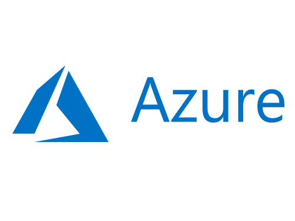
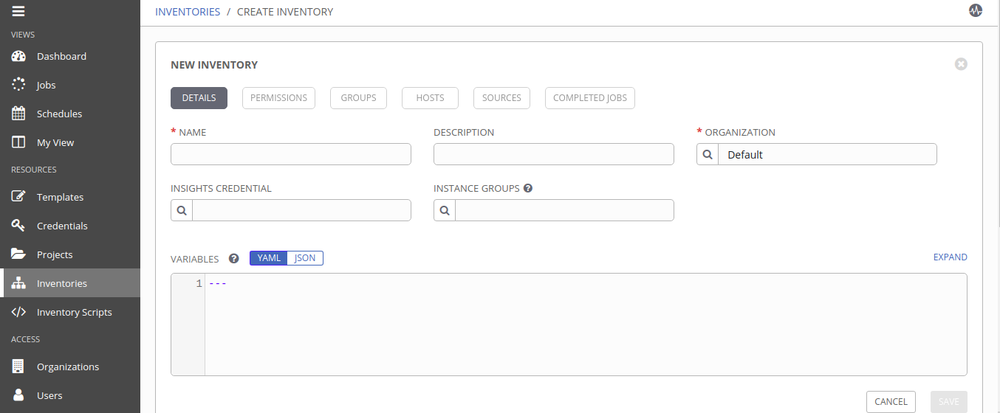
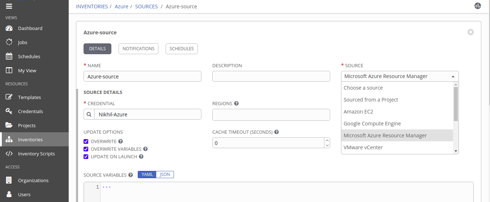
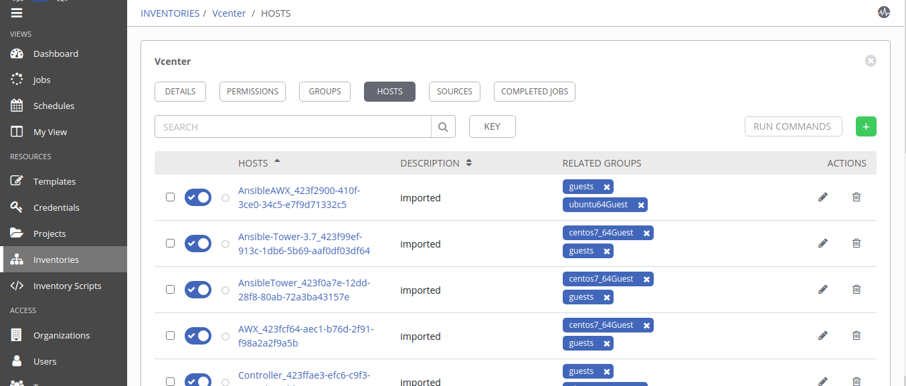
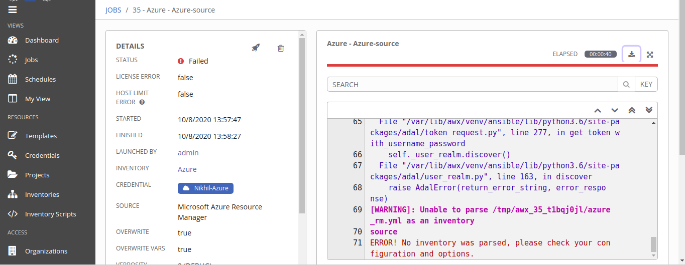

# MultiCloud VM Deployment [ Microsoft Azure ]
<p >
  <a href="https://cloud.google.com/"></a>
  </p>


This Component provides automated deployment of of virtual machines on Microsoft Azure. 

## Product Information
--------------------
Product: Microsoft Azure

Vendor: Microsoft

Vendor Site: https://azure.microsoft.com/en-in/

Version Supported: N/A

## Requirements
------------

Tested Operating Systems

- UBUNTU 18.04 LTS

Operating System Pre-Requisites

- Linux Machine

[Microsoft Azure account](https://azure.microsoft.com/en-in/free/).
	  
## Dependencies
------------
1. [python](https://www.python.org/) > 2.6
2. subscription id of Azure account


## Installation and Configuration

- step 1:  [install](https://docs.microsoft.com/en-us/cli/azure/install-azure-cli-apt?view=azure-cli-latest) Azure CLI

- step 2: Run the `login` command
```
az login
```
If the CLI can open your default browser, it will do so and load an Azure sign-in page.\
Otherwise, open a browser page at https://aka.ms/devicelogin and enter the authorization code displayed in your terminal.\
Sign in with your account credentials in the browser.\
To learn more about different authentication methods, see [Sign in with Azure CLI](https://docs.microsoft.com/en-us/cli/azure/authenticate-azure-cli?view=azure-cli-latest).

- Step3: Install Azure SDK for ansible


```
pip3 install 'ansible[azure]'
```

## Modules
------------------


- `azure_rm_resourcegroup`: To Create resource group on azure

- `azure_rm_virtualnetwork`: To create virtual network.

- `azure_rm_subnet`: To add a subnet

- `azure_rm_publicipaddress`: To assign publicIP address

- `azure_rm_securitygroup` : To create security group.


## Role Variables


| Variable Name   | Variable Description   |  Example Value of Variable | Variable Type
| :---------------| :----------------------| :--------------------------| :----------------
|  {{ resource_group }} | Secify name of resource group | Resource-group01 | user-input
|  {{ vm_name }}  | Name of the virtual machine | Vm01 | user-input
|  {{ vm_size }}  | Standard size of the VM  |  Standard_B1ls | user-input
| {{ username }} | username of your Virtual Machine | azureuser | user-input
|  {{ password }}  | password for your VM  |  Password@123  | user-input
| {{ azure_zone }} | reagion/zone in which your instance is located | southeastasia | Deafult
| {{ vm_network }} | Name of virtual network | myvNet | user-input
| {{ vm_subnet }} | Name of vm subnet | mysubnet | user-input
| {{ vm_publicip }} | Name of publicIP | mypublicIP | user-input
| {{ vm_nsg }} | Specifies Network Security Group | MyNSG | user-input
| {{ vm_nic }} | Specifies NIC | MyNIC | user-input
| {{ vm_offer }} |  The name of a group related images created by publisher | CentOS,UbuntuServer,WindowsServer | Default 
| {{ vm_pub }} | The organization that created the images | Canonical,OpenLogic | Default


 

Example Playbook
----------------

The below example playbook shows deploy an instance on Azure

```
---
    - name: Create VM
      azure_rm_virtualmachine:
        resource_group: {{ REASOURCE_GROUP_NAME }}
        name: {{ VM_NAME }}
        vm_size: {{ VM_SIZE }}
        admin_username: {{ VM_USERNAME }}
        admin_password: {{ VM_PASSWORD }} 
        image:
            offer: "{{ OFFER }}"
            publisher: "{{ PUBLISHER }}"
            sku: "{{ MAJOR_REALEASE }}"
            version: latest
```

## Extra variables JSON structure
```
{
  "extra_vars": {
    "provider": [
      "azure"
    ],
    "config_attributes" : {
       "azure" : {
        "resource_group" : "RESOURCE_GROUP_NAME",
        "vm_name" :"VM_NAME",
        "vm_size":"VM_SIZE",
        "username": "USERNAME",
        "password":"PASSWORD",
        "vm_subnet":"SUBNET",
        "vm_network":"NETWORK",
        "vm_nsg":"NSG"
        }
    }
  
  }
}
```

## Dynamic Inventory Sync

- Step 1: Go to Inventory tab and create new inventory. as shown in figure.
<p align="center">
  
</p>

- Step 2: Click on `Source` option , create new source , provider valid credentials and select `Microsoft Azure Resource Manager` as source type.<br>
Note: Do not forget to check `Ovewrite` option , Save it.
<br/>
then `start sync process` 

<p align="center">
  
</p>

Step3: Wait until sync process end then go to `hosts` tab to see
list of hosts available on VCenter.
<p align="center">
  
</p>

---
<font color="red" size="5">Blocker</font>
<p align="center">
  
</p>

- Failed to sync hosts from Azure. Showing error `No inventory was parsed`.
<p>
<a href="azure_sync_error.txt" target="_blank"> View detailed error </a>


License
-------
© Copyright 2020  `Great Software Laboratory`. All rights reserved.
