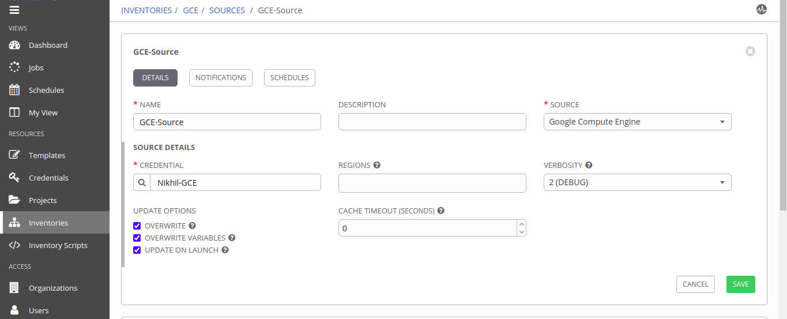

# MultiCloud VM Deployment [ Google Cloud ]
<p >
  <a href="https://cloud.google.com/"></a>
  </p>


This Component provides automated deployment of of virtual machines on Google Compute Engines. 

## Product Information
--------------------
Product: Google Cloud (GCE)

Vendor: Google

Vendor Site: https://cloud.google.com/

Version Supported: N/A

## Requirements
------------

Tested Operating Systems

- UBUNTU 18.04 LTS

Operating System Pre-Requisites

- Linux Machine
	  
## Dependencies
------------
1. [python](https://www.python.org/) > 2.6
2. [service account](https://developers.google.com/identity/protocols/oauth2/service-account#creatinganaccount) with `google compute engine`


## Installation and Configuration

Use the package manager [pip](https://pip.pypa.io/en/stable/) to install following packages to work with GCE's virtual machine.

```
pip3 install requests
pip3 install google-auth
```
`Note: Download service account file (.JSON or .pem ) and 
store somewhere securily.`


## Modules
------------------


- `gcp_compute_disk`:  Module used to create persistent disk for GCE instance. Persistent disks are available as either standard hard disk drives (HDD) or solid-state drives (SSD).

- `gcp_compute_address`: used for internal and external IP assignments to Instance.

- `gcp_compute_network`: Manages a VPC network or legacy network resource on GCP.

- `gcp_compute_instance`: this module is used to spawn a new instance on GCE.


## Role Variables


| Variable Name   | Variable Description   |  Example Value of Variable | Variable Type
| :---------------| :----------------------| :--------------------------| :----------------
|  {{ vm_name }} | Virtual Machine Name  | VM01 | user-input
|  {{ disk_size }}  | Disk size to be attached to VM (in GB's) | 50 | user-input
|  {{ gcp_project }}  | Project ID  |  Default
| {{ gcp_cred_kind }} | Type of authentication used e.g service account, machine account , appilcation | 2 | Default
|  {{ gcp_cred_file }}  |  path of credential file (.json / .pem) associated with service account   |  /path/credfile.json  | Default
| {{ region }} | reagion/zone in which your instance is located | south-ap-1 | Default
| {{ network_instance }} | Name of `gcp_compute_network` | network-insance | Default
| {{ disk_instance }} | Name of `gcp_compute_disk` | disk-instance | Default
| {{ address_instance }} | Name of `gcp_compute_address` | address | address-instance | Default
| {{ machine_type }} | Specifies machine type (Size of resource of VM) | n1-standard-1 | Default


## Extra variables JSON structure
```
{
  "extra_vars": {
    "provider": [
      "gce"
    ],
    "config_attributes" : {
       "gce" : {
            "vm_name" : "INSTANCE_NAME",
            "disk_size" :"DISK_SIZE"
        }
    }
  
  }
}
```


## Dynamic Inventory Sync

- Step 1: Go to Inventory tab and create new inventory. as shown in figure.
 

- Step 2: Click on `Source` option , create new source , provider valid credentials and select `Google Compute Engine` as source type.<br>
Note: Do not forget to check `Ovewrite` option , Save it.
<br/>
then `start sync process` <br/><br/>


- Step3: Wait until sync process end then go to `hosts` tab to see
list of hosts available on GCE.

---
### Error:

  

- Failed to sync hosts from GCE. Showing error `No inventory was parsed`.
<p>
<a href="files/gce_sync_error.txt" target="_blank"> View detailed error </a>


License
-------
© Copyright 2020  `Great Software Laboratory`. All rights reserved.
