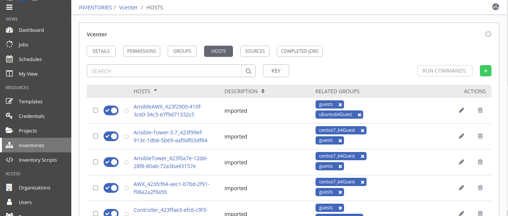
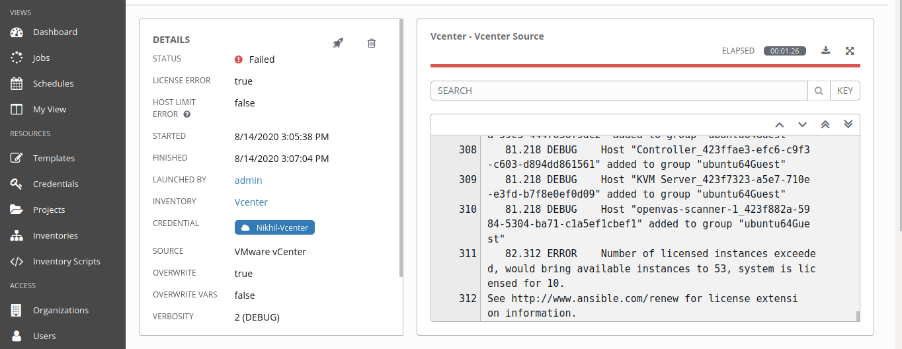

# MultiCloud VM Deployment [ Vmware Vcenter ]
<p >
  <a href="https://cloud.google.com/"></a>
  </p>


This Component provides automated deployment of of virtual machines on Vmware vcenter. 

## Product Information
--------------------
Product: Vcenter

Vendor: Vmware

Vendor Site: https://www.vmware.com/

Version Supported: N/A

## Requirements
------------

Tested Operating Systems

- UBUNTU 18.04 LTS

Operating System Pre-Requisites

- Linux Machine

[Vmware Vcenter Server](https://www.vmware.com/in/products/vcenter-server.html).
	  
## Dependencies
------------
1. [python](https://www.python.org/) > 2.6
2. vcenter client access for vm deployment.


## Installation and Configuration

- step 1:  [install](https://github.com/vmware/pyvmomi) PyVmomi Python SDK for Vsphere.

```
pip3 install pyvmomi
```

## Modules
------------------


- `vmware_guest`: The [vmware_guest](https://docs.ansible.com/ansible/latest/modules/vmware_guest_module.html#vmware-guest-module) module manages various operations related to virtual machines in the given ESXi or vCenter server.


## Role Variables


| Variable Name   | Variable Description   |  Example Value of Variable | Variable Type
| :---------------| :----------------------| :--------------------------| :----------------
|  {{ datacenter_name }} | Destination datacenter for the deploy operation | DC-01 | Default
  {{ cluster }}  | The cluster name where the virtual machine will run. | Cluster01 | Default
|  {{ datastore }}  | Specify datastore or datastore cluster to provision virtual machine.  |  NFS_Default-vcN | Default
| {{ username }} | username of provider (vcenter clinet) | azureuser | Default
|  {{ password }}  | password of provider (vcenter clinet) |  *******  | Default
| {{ hostname }} | The hostname or IP address of the vSphere vCenter or ESXi server. | 10.0.88.202 | Deafult
| {{ networks }} | Name of network adapter | VMvLan10 | Default
| {{ name }} | Name of virtual machine | MyVM | user-input
| {{ template }} | Template or existing virtual machine used to create new virtual machine. | tmpl_RHEL7.4 | user-input


 


## Extra variables JSON structure
```
{
  "extra_vars": {
    "provider": [
      "vcenter"
    ],
    "config_attributes" : {
       "vceter" : {
        "vm_name" : "VM_NAME",
        "template" :"TEMPLATE",
       }
    }
  
  }
}

```
## Dynamic Inventory Sync

- Step 1: Go to Inventory tab and create new inventory. as shown in figure.
 

- Step 2: Click on `Source` option , create new source , provider valid credentials and select `VMware Vcenter` as source type.<br>
Note: Do not forget to check `Ovewrite` option , Save it.
<br/>
then `start sync process` <br/><br/>


- Step3: Wait until sync process end then go to `hosts` tab to see
list of hosts available on Vcenter.
<br/><br/>


<h2>Limitation</h2>

  


- Ansible Tower showing `Licence error` i.e number of instances greater than host limit of current licensing of tower.
- Alternatively `Ansible AWX` can able to sync all hosts of vcenter.
<p>
<a href="files/vcenter_sync_error.txt" target="_blank"> View detailed error </a>


License
-------
© Copyright 2020  `Great Software Laboratory`. All rights reserved.
